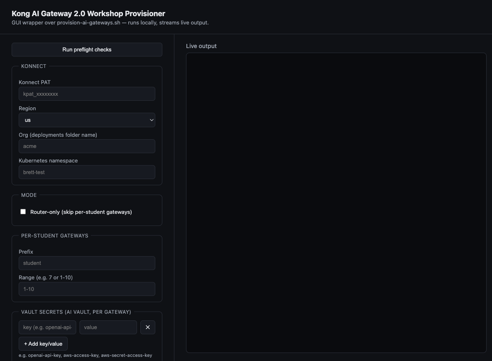

# Kong AI Gateway 2.0 Workshop Provisioner

## Intro

This script stands up a full Kong AI Gateway 2.0 workshop environment: per-student AI Gateway instances in Konnect, a shared AI Gateway Router control plane, Kubernetes data plane deployments, GCP DNS, and supporting services (PII sanitizer + Redis).

provision-ai-gateways.sh is the main script here. 

delete-ai-gateways.sh is not needed unless you run into a problem and want to mass-delete AI Gateways in the Konenct Org with y/n confirmation

deploy-ai-services.sh is also not needed unless for some reason you need to deploy redis and the sanitizer seperately from the main script

## Prerequisites

| Tool | Notes |
|------|-------|
| `bash` 4+ | might work with zsh. macOS ships bash 3; install via `brew install bash` |
| `gcloud` | Authenticated, with a default project set |
| `kubectl` | Pointed at a working GKE cluster |
| `helm` | With the `kong` repo added: `helm repo add kong https://charts.konghq.com` |
| `jq` | `brew install jq` |
| `openssl` | System openssl is fine |
| Kong Konnect PAT | Org-Admin personal access token |
| Vault keys for the lab | openai-api-key, aws-access-key, aws-secret-access-key |

The GKE cluster must have a node pool named `larger-node-pool` for the PII sanitizer and Redis workloads.

A GCP Cloud DNS managed zone named `sales-engineering` must exist in the active project.

## Usage

```bash
./provision-ai-gateways.sh [options]
```
example:
```bash
./provision-ai-gateways.sh --konnect_pat kpat_xxxxxxxxxx --prefix student --range 1-3 --org acme --namespace brett-test --apply-automatically
```

### Options

| Flag | Description |
|------|-------------|
| `--konnect_pat <token>` | Konnect PAT (prompted if omitted) |
| `--prefix <prefix>` | Gateway name prefix, e.g. `student` |
| `--range <range>` | Gateway range: single number (`7`) or range (`1-10`) |
| `--org <org>` | Konnect org name, used as the deployments folder |
| `--namespace <namespace>` | Kubernetes namespace |
| `--region <region>` | Konnect region — `us`, `eu`, `au` (default: `us`) |
| `--apply-automatically` | Skip all deploy prompts and apply everything |
| `--router-only` | Only create the AI Gateway Router; skip per-student gateways |

### Full workshop run

```bash
./provision-ai-gateways.sh \
  --konnect_pat <your-pat> \
  --prefix student \
  --range 1-15 \
  --org motion \
  --namespace motion \
  --apply-automatically
```

The script will interactively prompt for:
1. Vault secrets (key/value pairs stored in each student gateway's `ai` vault — e.g. `openai-api-key`, `aws-access-key`, `aws-secret-access-key`)

### Re-run a single failed gateway

```bash
./provision-ai-gateways.sh \
  --konnect_pat <your-pat> \
  --prefix student \
  --range 7 \
  --org motion \
  --namespace motion \
  --apply-automatically
```

### Recreate only the router

```bash
./provision-ai-gateways.sh \
  --konnect_pat <your-pat> \
  --org motion \
  --namespace motion \
  --router-only \
  --apply-automatically
```

## What the script does

1. **Per-student AI Gateways** (skipped with `--router-only`)
   - Creates an AI Gateway 2.0 object in Konnect (deletes and recreates on conflict)
   - Generates a TLS cert/key pair and registers it with the gateway
   - Creates a config store and `ai` vault, populating it with the secrets you entered
   - Writes a `deployments/<org>/<prefix>-<n>/values.yaml` and deploys the data plane via Helm

2. **AI Gateway Router control plane**
   - Deletes any existing `AI Gateway Router` control plane and recreates it
   - Generates a TLS cert/key pair, registers it, and writes `deployments/<org>/ai-gateway-router/values.yaml`
   - Deploys the router data plane (LoadBalancer type) via Helm
   - Waits for the LoadBalancer IP and upserts a GCP DNS A record: `aigw-<namespace>.<zone-dns-name>`
   - Creates a Kong service + route in the router for each student gateway

3. **Shared services** (deployed once into `<namespace>`)
   - Deploys `kong-pii-sanitizer` (ClusterIP on port 8080, image `kong/ai-pii-service` from Docker Hub)
   - Deploys `redis-vector-db` / `redis-stack-server` (ClusterIP on port 6379)
   - Waits for both rollouts to complete

## Output

Deployment artifacts (TLS certs, `values.yaml` files) are written to:

```
deployments/<org>/
  <prefix>-1/
    tls.crt
    tls.key
    values.yaml
  <prefix>-2/
    ...
  ai-gateway-router/
    tls.crt
    tls.key
    values.yaml
```

## GUI

A local web GUI wraps `provision-ai-gateways.sh` — no dependencies beyond stdlib Python 3.

```bash
python3 gui/server.py
```

Then open `http://localhost:8765` in a browser. The form mirrors the CLI flags, plus vault key/value rows, and buttons to run preflight checks and encrypt/decrypt `deployments/<org>/` artifacts. It always runs with `--apply-automatically` and streams the script's output live.



## Deleting

The delete script can be used to delete the AI GW 2.0 objects in the konnect org, asks y/n for each one.  Does not delete the dataplanes

